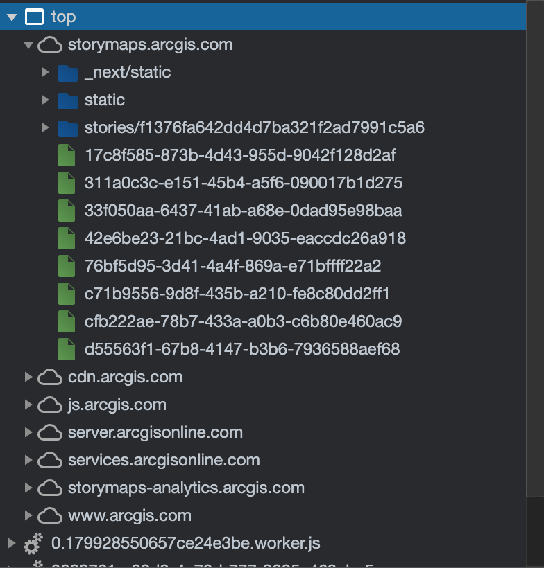
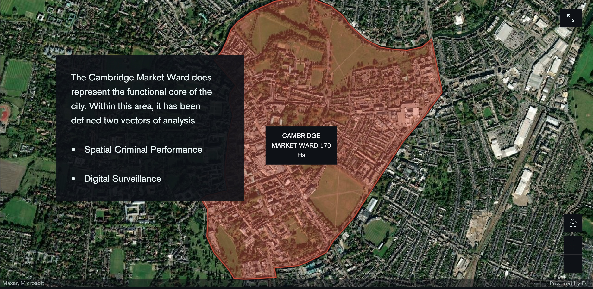
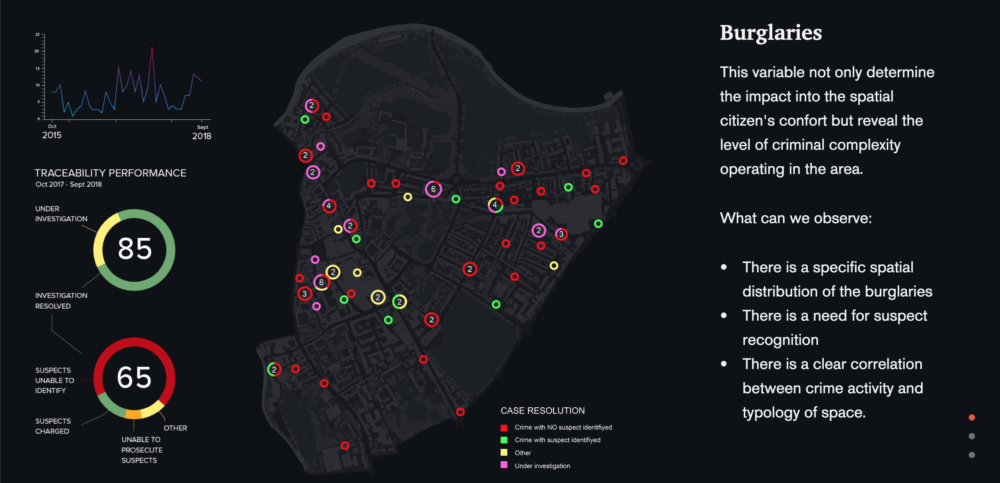
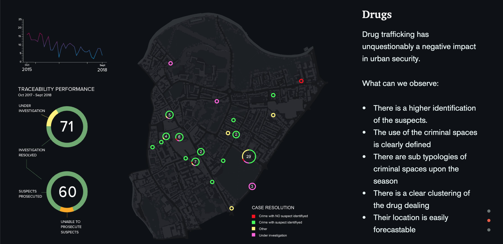
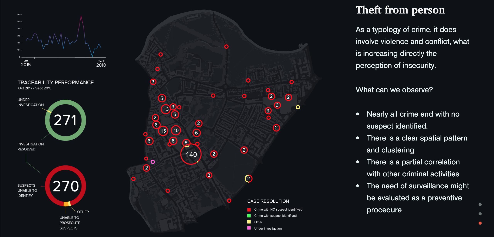
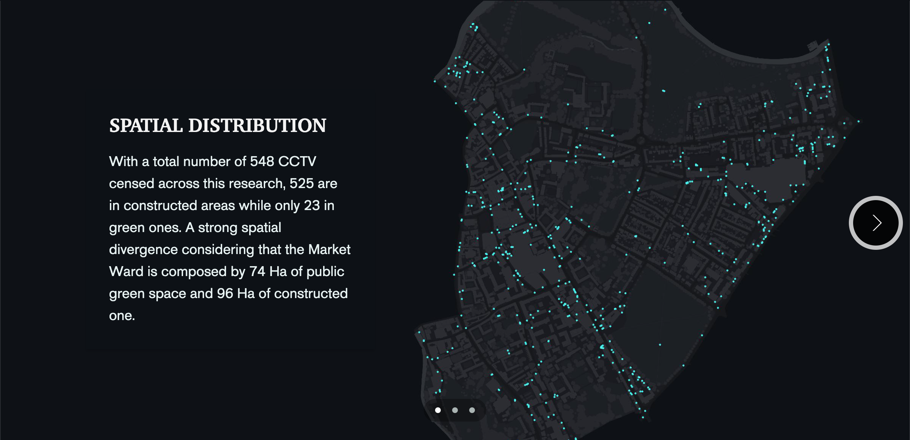
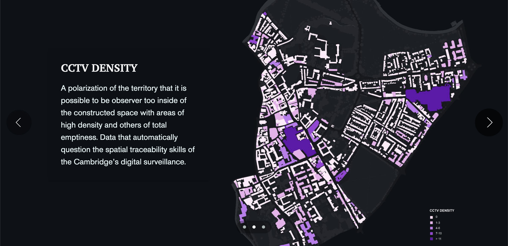
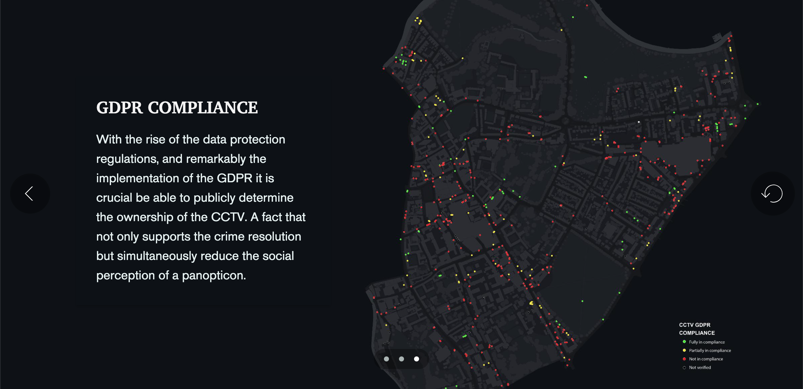
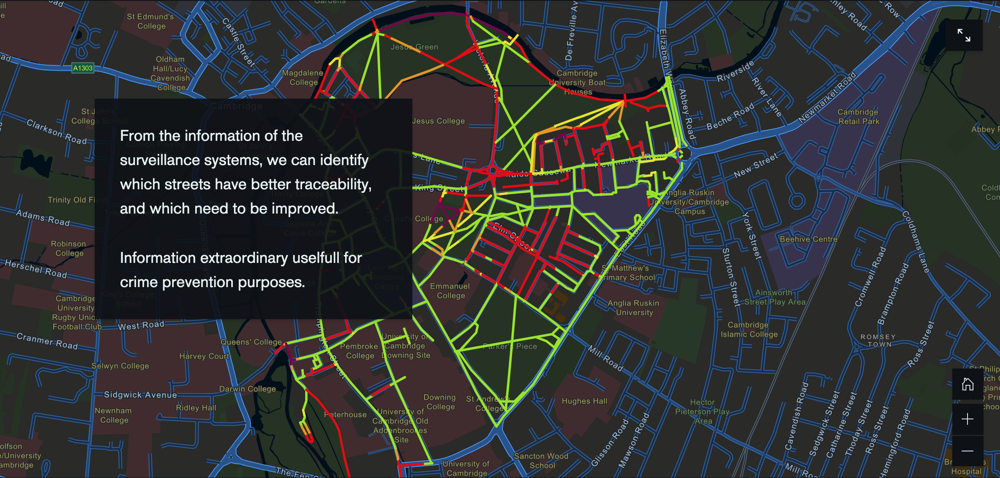
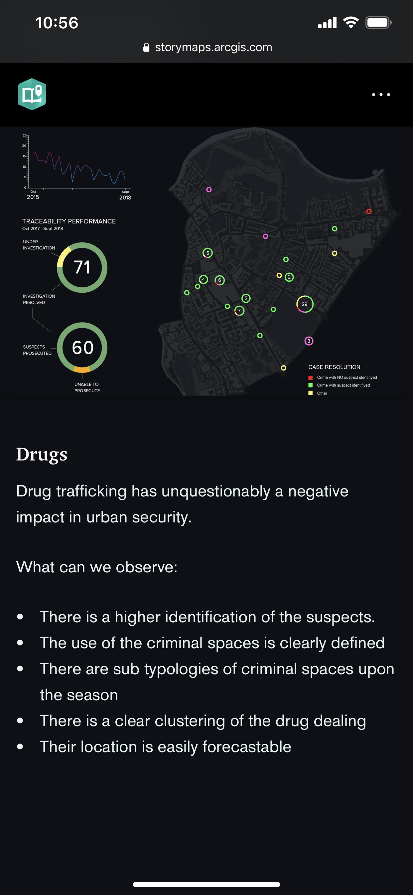

# Analysis of Samuel Najera's "Crime and Surveillance"

## Introduction

The digital-geography project that I will be analyzing is called “[Crime and Surveillance](https://storymaps.arcgis.com/stories/f1376fa642dd4d7ba321f2ad7991c5a6)” by Samuel Najera. It is a geo-narrative that utilizes ArcGIS’ StoryMaps to communicate “how to gather and analyze counter criminal intelligence to transform it into actionable policies” (Najera, 2020). For the StoryMap, it centers around Cambridge, England as its area of focus to examine the cohabitation of crime, surveillance, and worldwide prestigious universities. The major functions of this project makes use of the strengths of a geo-narrative, which is a visualization genre that primarily utilizes a series of maps, geovisualizations, scripts, images, and/or videos to narrate a geographical event or phenomenon. For instance, Najera implements various maps and geovisualizations throughout his project to demonstrate the Cambridge Market Ward, burglaries, drugs, and theft within the area. Additionally, for majority of maps and geovisualizations, Najera provides web map elements such as on click/hover popups, legends, graphs, zoom levels, full screen mode, and returning the map back to default mode. As for the intended audience of this project, there could be multiple audiences that Najera is attempting to reach out to. For example, the UK government is a possibility as Najera wants to communicate the burglaries, drug trafficking, thefts, and street traceability in the Cambridge Market Ward. Furthermore, another intended audience could the public as Najera wants to spread awareness of each of those issues along with the benefits of online mapping that helps to analyze, share, and deliver intelligence.For authors and affiliations, it seems that this is a single person project as Samuel Najera is the only person listed. However, he does indicate that he does have a PhD. Unfortunately, Najera did not include the date that he collected the data, but he does mentions that he utilized the public criminal data from www.police.uk as a data source to help produce his geo-narrative.

## Systematic Architecture

The systematic architecture that Najera’s project uses is ArcGIS StoryMaps’ client, server, and services. As you can see in Figure 1, ArcGIS provides its users with their resources to allow them to build geo-narratives like Najera’s. By bringing in his own data with the public criminal data, Najera was able to build his geo-narrative through the use of js.arcgis.com, server.arcgisonline.com, and services.arcgisonline.com. Additionally, I assume the data flows from the server to the client when Najera puts in his data. Furthermore, the major functions of his geo-narrative is implementing the features such as the on-click/hover popup, zoom levels, the ability to go full screen, and going back to the default viewing mode. Overall, viewing the source code for Najera’s project did not reveal much. However, I gave it my best effort researching the systematic architecture to come to the conclusion that client, server, and services are provided by ArcGIS when using StoryMaps and that the data used by Najera flows from ArcGIS’ server to its client.

*Figure 1: System Architecture*

## UI/UX and Web Mapping Design

The UI/UX and web mapping design of Najera’s “Crime and Surveillance” is great. His theme of dark mode styling fits well with the topic of crime and surveillance. Additionally, his choices of color, typography, spacing, labels, and icons gives his geo-narrative a modern look that catches the attention of users. Furthermore, Najera’s designs aid in his narration of the purpose, which is to demonstrate how gathering data and analyzing counter criminal intelligence can transform into actionable policies. Moreover, Najera supports his geo-narrative with nine visualizations. The first visualization is a map that utilizes the satellite basemap to outline the thematic layer of Cambridge Market Ward. Its features include a on click/hover popup to give details about the location, zoom levels, full screen mode, a short description, and reset view back to default mode.

*Figure 2: Cambridge Market Ward*

For the second visualization, it utilizes a dark monochrome basemap to showcase the thematic layer of case resolution of burglaries in the Cambridge Market Ward. Its features include graph and insight about traceability performance and investigations, a legend about case resolution, a short description, and a full screen mode.

*Figure 3: Burglaries in Cambridge Market Ward*

For the third visualization, it utilizes a dark monochrome basemap to showcase the thematic layer of case resolution of drugs in the Cambridge Market Ward. Its features include graph and insight about traceability performance and investigations, a legend about case resolution, a short description, and a full screen mode.

*Figure 4: Drugs in Cambridge Market Ward*

For the fourth visualization, it utilizes a dark monochrome basemap to showcase the thematic layer of case resolution of thefts in the Cambridge Market Ward. Its features include graph and insight about traceability performance and investigations, a legend about case resolution, a short description, and a full screen mode.

*Figure 5: Theft in Cambridge Market Ward*

For the fifth visualization, it utilizes a dark monochrome basemap to showcase the thematic layer of Spatial Distribution in the Cambridge Market Ward. Its features include a short description and a full screen mode.

*Figure 6: Spatial Distribution*

For the sixth visualization, it utilizes a dark monochrome basemap to showcase the thematic layer of CCTV Density in the Cambridge Market Ward. Its features include a legend about CCTV density, a short description, and a full screen mode.

*Figure 7: CCTV Density*

For the seventh visualization, it utilizes a dark monochrome basemap to showcase the thematic layer of CCTV GDPR Compliance in the Cambridge Market Ward. Its features include a legend about CCTV GDPR Compliance, a short description, and a full screen mode.

*Figure 8: GDPR Compliance*

For the eighth visualization, it utilizes a custom basemap highlight streets to showcase the thematic layer of Street Traceability in the Cambridge Market Ward. Its features include a short description, zoom levels, and a full screen mode.

*Figure 9: Street Traceability*

Lastly, for the ninth visualization, it utilizes a custom basemap to showcase the thematic layer of the Cambridge Market Ward Security. Its features include multiple short descriptions, graphs, insights, and a full screen mode.

*Figure 10: Cambridge Market Ward Security Map*

As for responsive design, Najera’s work does support responsive design as it is built on ArcGIS’ StoryMap platform. For example, when browsing on my laptop, I am able to scroll and view the geo-narrative while clicking on arrows to view visualizations. When I switch to my iPhone 11, I am still able to view everything smoothly and neatly just by scrolling.

*Figure 11: Responsive Design on Iphone 11*

## Pros and Cons

#### Pros
- Overall, the geo-narrative is well designed and neatly organized with information being concise and consistent.
- Each map and geovisualization is accompanied by summarized text to provide context for the audience.
- Each map has basemaps that strengthens its narrative. For example, the first map utilizes a satellite basemap that helps outline the Cambridge Market Ward. While for the next six maps, they have dark monochrome basemaps to help highlight areas that involve burglaries, drugs, theft, spatial distribution, CCTV density, and GDPR compliance. Furthermore, Najera’s “Safe Path” map utilizes a custom basemap that helps showcase street traceability. Moreover, his last map, “The Cambridge Market Ward Security Map” defines the infrastructure of the area really well.
- Some maps include useful features such as zoom level, legends, reset view, on click/hover popups, graphs and statistical insight accompanying maps, and good choice of colors and images.
- The narrative of the project is easy to follow and understands, which reduces any confusion that the audience could experience.

#### Cons
- The “Safe Path” map that displays street traceability and streets that need improvements lack a legend that could help communicate the meaning behind the street colors that Najera used in his map.
- The “Cambridge Market Ward Security Map” is hard to understand its content due to the small text, graphs, and visualizations. Additionally, there is no further zoom in feature to try to view the content. Overall, it’s aesthetically pleasing; however, it’s very difficult to understand the meaning and purpose behind the map.
- There is very little to no listing of data sources included in the geo-narrative. When providing data and visualizations, it’s important to provide the sources to strengthen the credibility of one’s work.

## Relevance to Digital Geographies

The goal of “Crime and Surveillance” is to gather and analyze counter criminal intelligence to transform it into actionable policies. This relates to the reading, “An Introduction to Critical Geography” since it mentions that “critical cartography challenges academic cartography by linking geographic knowledge with power, and thus is political” (Crampton & Krygier, 2006). Najera has evaluated the purpose behind his project as he utilized public criminal data to visualize and provide insight about the activities of criminals in the Cambridge Market Ward. By analyzing burglaries, drug trafficking, and theft within the area, he is able to spread awareness and perhaps initiate policies to reduce the criminal performance in the Cambridge Market Ward. Additionally, Najera highlight streets that needs improvement on traceability, which can help in preventing crimes. Furthermore, surveillance in this project is mentioned as a keyword, where it was emphasized that may be needed as a preventive procedure. This relates to the reading, “Real-Time GIS for Smart Cities” since it was mentioned that large cities suffer from numerous problems such as crime, congestion, pollution, etc. and a solution was to turn these cities into smart cities (Li et al., 2019). In particular, by turning a city into a smart city, this means installing real-time GIS, video cameras, and GPS devices to monitor the performance of the city. To do so, this could pose a threat to privacy depending on the level of surveillance that Najera would suggest. For example, a troublesome scenario would be similar to the insight provided by Hamid Khan from “The Activist Dismantling Racist Police Algorithms”. In this reading, Khan mentions that the Los Angeles Police Department (LAPD) uses an algorithm to “deem an area, an apartment building, as hot spots and zones” (Ryan-Mosley & Strong, 2020) in an attempt to respond to crimes in a faster rate. Along with captured data from surveillance and tracing utilities, this information gets stored in a data collection program that feeds the algorithm. The issue at hand is that the system is prone to biases. If surveillance systems in the Cambridge Market Ward uses an algorithm, it can potentially misrepresent people or the area due to human error as people are developing these systems. For instance, everyone has their own biases and if an algorithm is formed by biases that discriminate individuals based on race, gender, income, age, geography, etc., then these surveillance systems are actually hindering society rather than benefiting society.

On a different topic, our readings also focused on map design and geovisualizations. Starting with map design, in “The Guide to Map Design”, it was mentioned that map design “begins with the problem you’re solving” (The Guide to Map Design, n.d.). It is evident in this project that Najera identified the issues of crime in the Cambridge Market Ward and wanted to provide insight regarding these issues in hopes of initiating change. He followed the guidelines of delivering a quality design as he gathered data from research and implemented design principles that showcased his work elegantly with great choices of color, typography, spacing, labels, icons, etc. Additionally, Najera narrates his work in a concise, but yet empathetic way that voices his concerns about the criminal activities in the Cambridge Market Ward. By doing so, he appeals to a statement mentioned in “Affective Geovisualisations” that argues “the case for a more emotional approach to the aesthetics of mapping and suggests that geovisualisation can and should learn from film and deploy its tools in ways that powerfully affect everyday lives” (Aitken & Craine, 2006). Personally, I find this as an important factor for effective mapping since the engagement of the audience relies on the interactivity and storytelling of the map. Overall, for geovisualisations, there’s various factors to consider when creating a map and Najera was able to hit the nail on the head when thinking about the purpose, interactivity, and story of his map to create the essential engagement between his work and his audience.

## References

Aitken, S., & Craine, J. (2011). Affective Geovisualisations. Retrieved March 19, 2021, from https://drive.google.com/file/d/1aqMFkewNT9s9nrAecAVYiaBAbtCrf7xj/view
Crampton, J., & Krygier, J. (2016). An Introduction to Critical Cartography. Retrieved March 19, 2021, from https://drive.google.com/file/d/1IEz_9J4vH6foIrV36wDoIovOYNomZBWj/view
The Guide to Map Design. (n.d.). The Guide to Map Design. Retrieved March 19, 2021, from https://github.com/jakobzhao/geog458/blob/master/weeks/week05/mapbox-design.pdf
Li, W., Batty, M., & Goodchild, M. (2019, October 09). Real-time GIS for smart cities. Retrieved March 19, 2021, from https://drive.google.com/file/d/1COD2OYBxEJThG5Lfx7-nzV0EGtGedndT/view
Najera, S. (2020, May 22). Crime and surveillance. Retrieved March 19, 2021, from https://storymaps.arcgis.com/stories/f1376fa642dd4d7ba321f2ad7991c5a6
Ryan-Mosley, T., & Strong, J. (2020, June 05). The activist dismantling racist police algorithms. Retrieved March 19, 2021, from https://www.technologyreview.com/2020/06/05/1002709/the-activist-dismantling-racist-police-algorithms/
